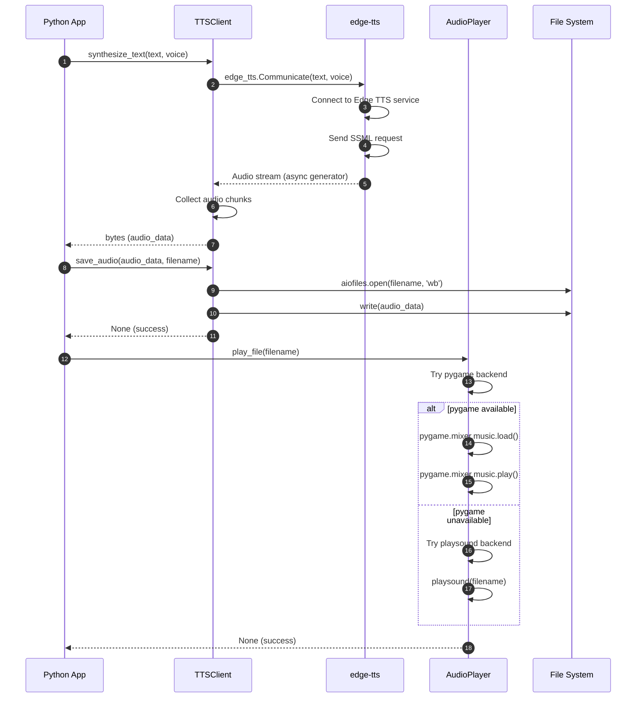

# Python TTS Implementation

This directory contains the Python implementation of the hello-edge-tts project using Microsoft Edge's TTS service. This implementation showcases async/await patterns, comprehensive error handling, and multiple audio backend support.

## 🏗️ Python Implementation Architecture

The Python implementation follows an async/await pattern with comprehensive error handling:



## ✨ Features

- ✅ **Async/await TTS synthesis** using edge-tts library
- ✅ **Multiple audio backends** (pygame, playsound) with fallback support
- ✅ **SSML support** for advanced speech markup language
- ✅ **Voice filtering and management** with language/gender filtering
- ✅ **Batch text processing** with concurrent async operations
- ✅ **Configuration management** with JSON/YAML support
- ✅ **Comprehensive error handling** and retry logic
- ✅ **Cross-platform audio playback** with multiple backend support
- ✅ **Command-line interface** with rich options

## 📋 Prerequisites

- **Python**: 3.7+ (Python 3.9+ recommended for optimal performance)
- **Package Manager**: pip (included with Python)
- **Virtual Environment**: venv or conda (recommended for isolation)
- **Internet Connection**: Required for TTS service access
- **Audio System**: Speakers/headphones for audio playback
- **System Libraries**: Platform-specific audio libraries (see troubleshooting)

## 🚀 Quick Start

```bash
# Navigate to Python directory
cd hello-edge-tts-python

# Create virtual environment (recommended)
python -m venv venv
source venv/bin/activate  # On Windows: venv\Scripts\activate

# Install dependencies
pip install -r requirements.txt

# Run basic example
python hello_tts.py

# Try with custom text and voice
python hello_tts.py --text "Hello from Python!" --voice "en-US-JennyNeural"
```

## 💡 Usage Examples

### Basic Text-to-Speech
```bash
# Simple synthesis with default voice
python hello_tts.py --text "Welcome to Python TTS!"

# Use specific voice
python hello_tts.py --text "Hello World" --voice "en-US-AriaNeural"

# Save to specific file
python hello_tts.py --text "Save me!" --output "my_speech.mp3"
```

### Voice Discovery
```bash
# List all available voices
python hello_tts.py --list-voices

# Filter voices by language
python hello_tts.py --voices-by-language "es"

# Find voices by gender
python hello_tts.py --list-voices | grep "Female"
```

### Advanced Features
```bash
# SSML synthesis
python advanced_tts.py --demo ssml

# Batch processing
python batch_examples.py --input texts.txt --concurrent 5

# Configuration demo
python config_demo.py --config config_examples/default.json
```

## 📁 Project Structure

```
hello-edge-tts-python/
├── 📄 README.md              # This documentation
├── 🎯 hello_tts.py           # Main CLI application
├── ⚡ advanced_tts.py        # Advanced features demo
├── 🔧 tts_client.py          # Core TTS client implementation
├── 🎵 audio_player.py        # Audio playback handling
├── 🎛️ config_manager.py      # Configuration management

├── 🎭 voice.py               # Voice model and utilities
├── 🛠️ utils.py               # Utility functions
└── 📦 requirements.txt       # Python dependencies
```

## 📦 Dependencies

| Package | Version | Purpose |
|---------|---------|---------|
| `edge-tts` | >=6.1.0 | Microsoft Edge TTS library |
| `pygame` | >=2.1.0 | Primary audio playback backend |
| `playsound` | >=1.3.0 | Fallback audio playback backend |
| `aiofiles` | >=0.8.0 | Async file operations |
| `requests` | >=2.28.0 | HTTP client support |
| `pyyaml` | >=6.0 | YAML configuration support |

## 🔧 API Reference

### TTSClient
Main class for TTS operations with async/await support.

```python
class TTSClient:
    async def synthesize_text(text: str, voice: str, use_ssml: bool = False) -> bytes
    async def synthesize_ssml(ssml: str) -> bytes
    async def save_audio(audio_data: bytes, filename: str) -> None
    async def list_voices() -> List[Voice]
    async def get_voices_by_language(language: str) -> List[Voice]
```

### AudioPlayer
Handles audio playback with multiple backend support.

```python
class AudioPlayer:
    def play_file(filename: str) -> None
    def play_audio_data(audio_data: bytes, format_hint: str = "mp3") -> None
    def get_available_backends() -> List[str]
```

### Voice
Represents voice information and metadata.

```python
@dataclass
class Voice:
    name: str
    display_name: str
    locale: str
    gender: str
    
    @property
    def language_code(self) -> str
    @property
    def country_code(self) -> str
    def matches_language(self, language: str) -> bool
```

## ⚡ Performance Characteristics

| Metric | Python Implementation | Comparison |
|--------|----------------------|------------|
| **Startup Time** | ~300ms | Good for scripting |
| **Memory Usage** | ~45MB active | Moderate due to interpreter |
| **Synthesis Speed** | Good | I/O bound operations excel |
| **Concurrent Performance** | Good | Limited by GIL for CPU tasks |
| **Development Speed** | Excellent | Rapid prototyping |
| **Ecosystem** | Excellent | Rich library ecosystem |

### Strengths
- 🚀 **Rapid Development**: Quick prototyping and iteration
- 📚 **Rich Ecosystem**: Extensive library support
- 🔄 **Async I/O**: Excellent for network-bound operations
- 🧪 **Testing**: Comprehensive testing frameworks

### Best Use Cases
- 🤖 **AI/ML Integration**: Perfect for AI applications
- 📊 **Data Processing**: Excellent for data analysis
- 🔧 **Scripting**: Ideal for automation scripts
- 🎓 **Learning**: Great for educational purposes

---

## 🔗 Related Links

- 📖 [Main Project README](../README.md) - Complete project overview
- 🎯 [Dart Implementation](../hello-edge-tts-dart/README.md) - Cross-platform alternative
- 🦀 [Rust Implementation](../hello-edge-tts-rust/README.md) - High-performance alternative  
- ☕ [Java Implementation](../hello-edge-tts-java/README.md) - Enterprise alternative

## 📞 Support

For Python-specific issues:
1. Check the troubleshooting section above
2. Review the [main project documentation](../README.md)
3. Search existing GitHub issues
4. Create a new issue with the `python` label

**Happy coding with Python! 🐍**
- ✅ Comprehensive error handling and logging
- ✅ Cross-platform audio playback
- ✅ Command-line interface with rich options

## Prerequisites

- Python 3.7 or higher (Python 3.9+ recommended)
- pip package manager
- Internet connection for TTS service access
- Audio playback capabilities (speakers/headphones)
- Optional: Virtual environment (recommended)

## Quick Start

1. Navigate to the python directory:
```bash
cd python
```

2. Create and activate virtual environment (recommended):
```bash
python -m venv venv
# On Windows:
venv\Scripts\activate
# On macOS/Linux:
source venv/bin/activate
```

3. Install required dependencies:
```bash
pip install -r requirements.txt
```

4. Run basic example:
```bash
python hello_tts.py
```

## Usage

### Basic Usage

Run the basic TTS example:
```bash
python hello_tts.py
```

This will convert "Hello, World!" to speech using the default voice and save it as an audio file.

### Custom Text and Voice

```bash
python hello_tts.py --text "Your custom text here" --voice "en-US-JennyNeural"
```

### Available Options

- `--text, -t`: Text to convert to speech (default: "Hello, World!")
- `--voice, -v`: Voice to use (default: en-US-AriaNeural)
- `--output, -o`: Output filename (default: auto-generated)
- `--no-play`: Don't play audio after generation
- `--list-voices, -l`: List all available voices

## Examples

### List Available Voices
```bash
python hello_tts.py --list-voices
```

### Generate Speech with Different Voice
```bash
python hello_tts.py --text "Hello from Python!" --voice "en-US-DavisNeural"
```

### Save to Specific File
```bash
python hello_tts.py --text "Save me!" --output "my_speech.mp3"
```

### Generate Without Playing
```bash
python hello_tts.py --text "Silent generation" --no-play
```

## Project Structure

```
python/
├── __init__.py           # Package initialization
├── hello_tts.py          # Main CLI application
├── advanced_tts.py       # Advanced features (placeholder)
├── tts_client.py         # TTSClient implementation
├── voice.py              # Voice model and management
├── audio_player.py       # Audio playback functionality
├── config.py             # Configuration management
├── utils.py              # Utility functions
├── requirements.txt      # Python dependencies
└── README.md            # This file
```

## API Reference

### TTSClient

Main class for TTS operations with async/await support.

```python
from tts_client import TTSClient

client = TTSClient()

# Synthesize text to audio data
audio_data = await client.synthesize_text("Hello!", "en-US-AriaNeural")

# Save audio to file
await client.save_audio(audio_data, "output.mp3")

# List all voices
voices = await client.list_voices()

# Get voices by language
en_voices = await client.get_voices_by_language("en")
```

### Voice

Represents voice information and metadata.

```python
from voice import Voice

voice = Voice(
    name="en-US-AriaNeural",
    display_name="Microsoft Aria Online (Natural) - English (United States)",
    locale="en-US",
    gender="Female"
)

print(voice.language_code)  # "en"
print(voice.country_code)   # "US"
```

### AudioPlayer

Handles audio playback with multiple backend support.

```python
from audio_player import AudioPlayer

player = AudioPlayer()

# Play audio file
player.play_file("output.mp3")

# Play audio from bytes
player.play_audio_data(audio_data, format_hint="mp3")

# Check available backends
backends = player.get_available_backends()  # ['pygame', 'playsound']
```

### TTSConfig

Configuration management for TTS settings.

```python
from config import TTSConfig

config = TTSConfig(
    default_voice="en-US-AriaNeural",
    output_format="mp3",
    auto_play=True
)
```

## Dependencies

- `edge-tts>=6.1.0`: Microsoft Edge TTS library
- `pygame>=2.1.0`: Audio playback (primary backend)
- `playsound>=1.3.0`: Audio playback (fallback backend)
- `aiofiles>=0.8.0`: Async file operations
- `requests>=2.28.0`: HTTP client support

## Troubleshooting

### Common Issues

#### 1. Installation and Dependencies

**Import Error or Module Not Found**
```bash
# Solution: Ensure all dependencies are installed
pip install -r requirements.txt

# If using virtual environment, make sure it's activated
source venv/bin/activate  # macOS/Linux
venv\Scripts\activate     # Windows

# Upgrade pip if needed
python -m pip install --upgrade pip
```

**Python Version Issues**
```bash
# Check Python version
python --version

# If using Python 3.7, some features may be limited
# Recommended: Python 3.9+
```

#### 2. Audio Playback Issues

**No Audio Output**
- Check system volume and audio device
- Verify speakers/headphones are connected
- Test with system audio first

**Audio Backend Issues**
```bash
# Install primary audio backend
pip install pygame

# If pygame fails, try alternative
pip install playsound

# For Linux users, install system audio libraries
sudo apt-get install python3-dev libasound2-dev  # Ubuntu/Debian
sudo yum install python3-devel alsa-lib-devel    # CentOS/RHEL
```

**Audio Format Issues**
- Default format is MP3 (widely supported)
- Try WAV format if MP3 fails: `--format wav`
- Check available audio codecs on your system

#### 3. Network and Service Issues

**Connection Timeout or Service Unavailable**
```bash
# Check internet connection
ping microsoft.com

# Test with curl
curl -I https://speech.platform.bing.com

# Check firewall settings
# Corporate networks may block TTS service
```

**SSL/TLS Certificate Issues**
```bash
# Update certificates
pip install --upgrade certifi

# For corporate networks, check proxy settings
export HTTPS_PROXY=your-proxy:port
```

#### 4. File System and Permissions

**Permission Denied Errors**
```bash
# Create output directory with proper permissions
mkdir -p output
chmod 755 output

# Check write permissions
touch output/test.txt && rm output/test.txt
```

**File Path Issues**
- Use absolute paths if relative paths fail
- Avoid special characters in filenames
- Check disk space availability

#### 5. Voice and Language Issues

**Voice Not Found**
```bash
# List available voices
python hello_tts.py --list-voices

# Use exact voice name from the list
python hello_tts.py --voice "en-US-AriaNeural"
```

**Language/Locale Issues**
- Ensure voice matches text language
- Use appropriate locale codes (en-US, es-ES, etc.)
- Check voice availability for your region

### Error Messages and Solutions

| Error Message | Cause | Solution |
|---------------|-------|----------|
| `TTSError: Failed to synthesize text` | Network/service issue | Check internet connection, verify voice name |
| `AudioError: No audio backends available` | Missing audio libraries | Install pygame or playsound |
| `TTSError: Failed to list voices` | Network connectivity | Check internet connection and firewall |
| `AudioError: Audio file not found` | File path issue | Verify file path and permissions |
| `TTSError: Text too long` | Input text exceeds limit | Split text into smaller chunks |
| `ConfigError: Invalid configuration` | Config file issue | Check JSON/YAML syntax |
| `ImportError: No module named 'edge_tts'` | Missing dependency | Run `pip install -r requirements.txt` |
| `PermissionError: [Errno 13]` | File permissions | Check write permissions for output directory |

### Performance Issues

**Slow Synthesis**
- Check internet connection speed
- Use shorter text chunks for faster processing
- Consider caching frequently used audio

**Memory Usage**
- Large audio files consume memory
- Process files in batches for bulk operations
- Clear audio data after playback if not needed

### Platform-Specific Issues

#### Windows
```bash
# Audio issues on Windows
pip install winsound  # Built-in Windows audio

# Path separator issues
# Use forward slashes or raw strings
output_path = r"C:\output\audio.mp3"
```

#### macOS
```bash
# Install audio dependencies
brew install portaudio
pip install pyaudio

# Permission issues with microphone access
# Check System Preferences > Security & Privacy
```

#### Linux
```bash
# Install audio system dependencies
sudo apt-get install libasound2-dev python3-dev  # Ubuntu/Debian
sudo dnf install alsa-lib-devel python3-devel    # Fedora
sudo pacman -S alsa-lib python                    # Arch Linux

# PulseAudio issues
pulseaudio --check -v
```

### Getting Help

1. **Check logs**: Enable verbose logging with `--verbose` flag
2. **Test with minimal example**: Use basic hello_tts.py first
3. **Verify dependencies**: Run `pip list` to check installed packages
4. **Check system requirements**: Ensure Python version compatibility
5. **Test network connectivity**: Verify access to Microsoft services

## Advanced Usage and Examples

### 1. Basic Library Usage

```python
import asyncio
from tts_client import TTSClient
from audio_player import AudioPlayer

async def basic_example():
    """Basic TTS synthesis example."""
    client = TTSClient()
    
    # Synthesize text
    audio_data = await client.synthesize_text(
        "Hello from Python!", 
        "en-US-AriaNeural"
    )
    
    # Save to file
    await client.save_audio(audio_data, "hello.mp3")
    
    # Play audio
    player = AudioPlayer()
    player.play_file("hello.mp3")

asyncio.run(basic_example())
```

### 2. Voice Discovery and Selection

```python
async def voice_discovery():
    """Discover and filter voices by language."""
    client = TTSClient()
    
    # Get all voices
    all_voices = await client.list_voices()
    print(f"Total voices available: {len(all_voices)}")
    
    # Get English voices
    en_voices = await client.get_voices_by_language("en")
    print(f"English voices: {len(en_voices)}")
    
    # Filter by gender
    female_voices = [v for v in en_voices if v.gender == "Female"]
    male_voices = [v for v in en_voices if v.gender == "Male"]
    
    print(f"Female voices: {len(female_voices)}")
    print(f"Male voices: {len(male_voices)}")
    
    # Use different voices
    for voice in en_voices[:3]:  # First 3 voices
        print(f"Testing voice: {voice.display_name}")
        audio_data = await client.synthesize_text(
            f"Hello, I am {voice.display_name}",
            voice.name
        )
        filename = f"voice_{voice.name.replace('-', '_')}.mp3"
        await client.save_audio(audio_data, filename)

asyncio.run(voice_discovery())
```

### 3. SSML (Speech Synthesis Markup Language)

```python
from ssml_utils import SSMLBuilder

async def ssml_examples():
    """Demonstrate SSML features."""
    client = TTSClient()
    voice = "en-US-AriaNeural"
    
    # Using SSMLBuilder for complex markup
    builder = SSMLBuilder(voice)
    
    # Rate and pitch control
    ssml = (builder
            .add_text("This is ")
            .add_prosody("slow speech", rate="slow")
            .add_text(" and this is ")
            .add_prosody("fast speech", rate="fast")
            .add_break("1s")
            .add_prosody("high pitch", pitch="high")
            .add_text(" and ")
            .add_prosody("low pitch", pitch="low")
            .build())
    
    audio_data = await client.synthesize_ssml(ssml)
    await client.save_audio(audio_data, "ssml_prosody.mp3")
    
    # Emphasis and breaks
    emphasis_ssml = '''
    <speak version="1.0" xmlns="http://www.w3.org/2001/10/synthesis" xml:lang="en-US">
        <voice name="en-US-AriaNeural">
            This is <emphasis level="strong">very important</emphasis>.
            <break time="2s"/>
            And this comes after a pause.
        </voice>
    </speak>
    '''
    
    audio_data = await client.synthesize_ssml(emphasis_ssml)
    await client.save_audio(audio_data, "ssml_emphasis.mp3")

asyncio.run(ssml_examples())
```

### 4. Batch Processing

```python
async def batch_processing():
    """Process multiple texts efficiently."""
    client = TTSClient()
    
    texts = [
        "First sentence to synthesize.",
        "Second sentence with different content.",
        "Third sentence for batch processing demo."
    ]
    
    voice = "en-US-AriaNeural"
    
    # Process all texts concurrently
    tasks = []
    for i, text in enumerate(texts):
        task = client.synthesize_text(text, voice)
        tasks.append((i, task))
    
    # Wait for all to complete
    results = []
    for i, task in tasks:
        try:
            audio_data = await task
            filename = f"batch_{i+1}.mp3"
            await client.save_audio(audio_data, filename)
            results.append((i, filename, "success"))
        except Exception as e:
            results.append((i, None, f"error: {e}"))
    
    # Report results
    for i, filename, status in results:
        print(f"Text {i+1}: {status}")

asyncio.run(batch_processing())
```

### 5. Configuration Management

```python
from config import TTSConfig

async def configuration_example():
    """Demonstrate configuration usage."""
    
    # Create custom configuration
    config = TTSConfig(
        default_voice="en-US-JennyNeural",
        output_format="wav",
        output_directory="./custom_output",
        auto_play=False,
        cache_voices=True
    )
    
    # Use configuration with client
    client = TTSClient(config)
    
    # Configuration is automatically applied
    audio_data = await client.synthesize_text("Configured TTS example")
    # Will save as WAV in custom_output directory
    await client.save_audio(audio_data, "configured.wav")
    
    # Load configuration from file
    config_from_file = TTSConfig.from_file("config_examples/default.json")
    client_from_config = TTSClient(config_from_file)

asyncio.run(configuration_example())
```

### 6. Multi-language Support

```python
async def multilingual_example():
    """Demonstrate multi-language TTS."""
    
    # Language samples with appropriate voices
    samples = [
        ("Hello, how are you today?", "en-US-AriaNeural"),
        ("Hola, ¿cómo estás hoy?", "es-ES-ElviraNeural"),
        ("Bonjour, comment allez-vous aujourd'hui?", "fr-FR-DeniseNeural"),
        ("Hallo, wie geht es dir heute?", "de-DE-KatjaNeural"),
        ("こんにちは、今日はいかがですか？", "ja-JP-NanamiNeural"),
    ]
    
    client = TTSClient()
    
    for i, (text, voice) in enumerate(samples):
        try:
            print(f"Synthesizing: {text[:30]}...")
            audio_data = await client.synthesize_text(text, voice)
            
            # Extract language code from voice name
            lang_code = voice.split('-')[0]
            filename = f"multilingual_{lang_code}_{i+1}.mp3"
            
            await client.save_audio(audio_data, filename)
            print(f"Saved: {filename}")
            
        except Exception as e:
            print(f"Error with {voice}: {e}")

asyncio.run(multilingual_example())
```

### 7. Error Handling and Resilience

```python
import logging
from tts_client import TTSClient, TTSError
from audio_player import AudioPlayer, AudioError

# Configure logging
logging.basicConfig(level=logging.INFO)
logger = logging.getLogger(__name__)

async def robust_tts_example():
    """Demonstrate comprehensive error handling."""
    
    client = TTSClient()
    player = AudioPlayer()
    
    # Test cases with potential issues
    test_cases = [
        ("Valid text", "en-US-AriaNeural", "valid.mp3"),
        ("Valid text", "invalid-voice-name", "invalid_voice.mp3"),
        ("", "en-US-AriaNeural", "empty_text.mp3"),  # Empty text
        ("Very long text " * 1000, "en-US-AriaNeural", "long_text.mp3"),  # Very long
    ]
    
    for text, voice, filename in test_cases:
        try:
            logger.info(f"Processing: {filename}")
            
            # Synthesize with timeout
            audio_data = await asyncio.wait_for(
                client.synthesize_text(text, voice),
                timeout=30.0  # 30 second timeout
            )
            
            # Save with error handling
            await client.save_audio(audio_data, filename)
            
            # Play with fallback
            try:
                player.play_file(filename)
            except AudioError as ae:
                logger.warning(f"Playback failed for {filename}: {ae}")
                # Try alternative playback method
                try:
                    player.play_audio_data(audio_data, format_hint="mp3")
                except AudioError:
                    logger.error(f"All playback methods failed for {filename}")
            
            logger.info(f"Successfully processed: {filename}")
            
        except asyncio.TimeoutError:
            logger.error(f"Timeout processing {filename}")
        except TTSError as te:
            logger.error(f"TTS error for {filename}: {te}")
        except Exception as e:
            logger.error(f"Unexpected error for {filename}: {e}")

asyncio.run(robust_tts_example())
```

### 8. Performance Optimization

```python
import time
from concurrent.futures import ThreadPoolExecutor

async def performance_example():
    """Demonstrate performance optimization techniques."""
    
    client = TTSClient()
    
    # Measure synthesis time
    start_time = time.time()
    
    text = "This is a performance test of the TTS system."
    voice = "en-US-AriaNeural"
    
    # Single synthesis
    audio_data = await client.synthesize_text(text, voice)
    synthesis_time = time.time() - start_time
    
    print(f"Synthesis time: {synthesis_time:.2f} seconds")
    print(f"Audio size: {len(audio_data)} bytes")
    
    # Concurrent processing for multiple texts
    texts = [f"Performance test number {i+1}" for i in range(5)]
    
    start_time = time.time()
    
    # Process concurrently
    tasks = [client.synthesize_text(text, voice) for text in texts]
    results = await asyncio.gather(*tasks, return_exceptions=True)
    
    concurrent_time = time.time() - start_time
    successful_results = [r for r in results if not isinstance(r, Exception)]
    
    print(f"Concurrent processing time: {concurrent_time:.2f} seconds")
    print(f"Successful syntheses: {len(successful_results)}/{len(texts)}")
    
    # Voice caching demonstration
    print("\nTesting voice caching...")
    
    # First call (cache miss)
    start_time = time.time()
    voices = await client.list_voices()
    first_call_time = time.time() - start_time
    
    # Second call (cache hit)
    start_time = time.time()
    voices_cached = await client.list_voices()
    second_call_time = time.time() - start_time
    
    print(f"First voice list call: {first_call_time:.2f} seconds")
    print(f"Cached voice list call: {second_call_time:.2f} seconds")
    print(f"Cache speedup: {first_call_time/second_call_time:.1f}x")

asyncio.run(performance_example())
```